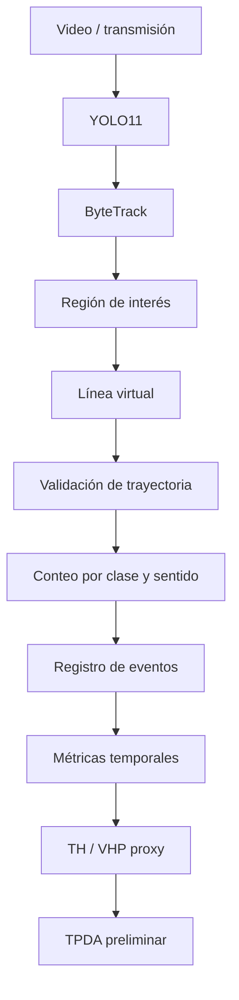

# MCI-509 · Sistema de detección y aforo vehicular con YOLO11

Sistema de visión computacional para detección, clasificación, seguimiento y aforo vehicular en tiempo real mediante **YOLO11** y **ByteTrack**.

Proyecto final del módulo **MCI-509 – Procesamiento de Imágenes y Visión Computacional** de la Maestría en Ciencia de Datos e Inteligencia Artificial Aplicada de la Universidad Católica Boliviana "San Pablo".

## Equipo

- Jhonny Paul Pinto Phillips
- Ronald Marcelo Pinto Delgadillo

---

## Resumen

El proyecto desarrolla un sistema capaz de detectar, clasificar, seguir y contabilizar vehículos a partir de imágenes, videos y transmisiones públicas.

La solución utiliza **YOLO11** para detección y **ByteTrack** para seguimiento multiobjeto. Sobre una región de interés (ROI) y una línea virtual se implementa una lógica de cruce que evita contabilizar repetidamente el mismo vehículo.

El detector fue entrenado inicialmente utilizando imágenes de tráfico de Sri Lanka y posteriormente adaptado a una cámara urbana de Buenos Aires mediante un segundo proceso de fine-tuning. Los eventos generados por el sistema permiten además calcular métricas temporales de tráfico y una estimación preliminar del Tránsito Promedio Diario Anual (TPDA).

---

## Objetivos

El pipeline desarrollado permite:

- detectar vehículos en imágenes, videos y transmisiones públicas;
- clasificar seis tipos de vehículos;
- realizar seguimiento multiobjeto mediante ByteTrack;
- mantener identificadores persistentes entre fotogramas;
- definir una región de interés;
- utilizar una línea virtual de conteo;
- contabilizar vehículos por clase y sentido de circulación;
- registrar eventos con marca temporal;
- separar las ejecuciones mediante identificadores de sesión;
- calcular métricas móviles de tráfico;
- obtener tránsito horario;
- estimar preliminarmente el TPDA.

---

## Clases vehiculares

| ID | Clase |
|---:|---|
| 0 | `car` |
| 1 | `threewheel` |
| 2 | `bus` |
| 3 | `truck` |
| 4 | `motorbike` |
| 5 | `van` |

---

## Pipeline



---

# Dataset

## Dominio original

Se utilizó el dataset:

**Vehicle Dataset for YOLO — Nadin Pethiyagoda**

Kaggle:

https://www.kaggle.com/datasets/nadinpethiyagoda/vehicle-dataset-for-yolo/

Licencia:

**Database Contents License (DbCL) v1.0**

https://opendatacommons.org/licenses/dbcl/1-0/

El conjunto contenía inicialmente **3.000 imágenes**. Después de detectar y eliminar **63 duplicados**, quedaron **2.937 imágenes únicas**.

| Split | Imágenes | Objetos |
|---|---:|---:|
| Train | 2.056 | 2.616 |
| Val | 587 | 756 |
| Test | 294 | 380 |
| **Total** | **2.937** | **3.752** |

La división se realizó utilizando una semilla fija de `42`.

---

## Dominio objetivo

Para adaptar el detector al escenario real se construyó un segundo conjunto utilizando imágenes de una transmisión pública de tráfico urbano de la **avenida Independencia, Buenos Aires**.

Se seleccionaron y anotaron manualmente **100 imágenes** mediante **LabelImg**.

Distribución:

| Split | Imágenes |
|---|---:|
| Train | 80 |
| Val | 10 |
| Test | 10 |

Objetos anotados:

| Clase | Objetos |
|---|---:|
| `car` | 1.312 |
| `bus` | 154 |
| `truck` | 82 |
| `motorbike` | 152 |
| `van` | 137 |
| `threewheel` | 0 |
| **Total** | **1.837** |

La división se realizó respetando el orden temporal de captura para disminuir el riesgo de fuga entre fotogramas visualmente muy próximos.

---

## Dataset V2

El dataset utilizado en el segundo fine-tuning combinó:

- 2.056 imágenes originales de entrenamiento;
- 80 imágenes del dominio objetivo.

Resultado:

| Split | Imágenes |
|---|---:|
| Train | 2.136 |
| Val | 597 |
| Test original Sri Lanka | 294 |

El conjunto de prueba original se mantuvo sin modificaciones para evaluar si la adaptación al nuevo dominio degradaba el desempeño previamente alcanzado.

---

## Obtención y preparación de los datos

El dataset original puede descargarse directamente desde Kaggle:

https://www.kaggle.com/datasets/nadinpethiyagoda/vehicle-dataset-for-yolo/

Los datos pesados no se almacenan directamente en Git.

Los scripts incluidos en `src/` permiten reproducir las principales etapas de preparación:

```text
src/preparar_dataset.py
src/auditar_dataset.py
src/analizar_conflictos_duplicados.py
src/capturar_frames.py
src/preanotar_dominio.py
src/recortar_roi_dominio.py
```

La estructura esperada para el dataset V2 es:

```text
datos/
└── dataset_v2/
    ├── images/
    │   ├── train/
    │   ├── val/
    │   └── test/
    ├── labels/
    │   ├── train/
    │   ├── val/
    │   └── test/
    └── data.yaml
```

---

## Limitaciones de los datos

- existe un fuerte desbalance entre clases;
- `car` domina el dominio objetivo;
- no se observó `threewheel` en Buenos Aires;
- el dominio objetivo contiene únicamente 100 imágenes;
- las imágenes objetivo proceden de una sola cámara;
- existe dependencia temporal entre fotogramas próximos;
- `truck` y `van` presentan menor representación.

---

# Pesos entrenados

Los archivos `.pt` no se almacenan directamente en el repositorio.

Se recomienda descargarlos dentro de:

```text
pesos/
├── yolo11n_vehiculos_v1_best.pt
└── yolo11n_vehiculos_v2_best.pt
```

## Modelo V1

Primer modelo especializado sobre el dominio original.

**Archivo esperado:**

```text
pesos/yolo11n_vehiculos_v1_best.pt
```

**Descarga:**

https://drive.google.com/file/d/1cd4Z4sV1ArttSYcvBeu56WbBR2gPsjA5/view?usp=sharing

---

## Modelo V2 final

Modelo final utilizado en el sistema de aforo y en los resultados principales del proyecto.

**Archivo esperado:**

```text
pesos/yolo11n_vehiculos_v2_best.pt
```

**Descarga:**

https://drive.google.com/file/d/1K7WR4iY8wVuchwy7xY4ygplXs_XqTyEQ/view?usp=sharing

---

# Modelos y entrenamiento

## Modelo V1

El primer fine-tuning se realizó sobre el dominio original.

Resultados sobre el test de Sri Lanka:

| Métrica | Resultado |
|---|---:|
| Precisión | 0.9557 |
| Recall | 0.9563 |
| mAP@50 | 0.9787 |
| mAP@50-95 | 0.8960 |

---

## Modelo V2

El modelo V2 parte del mejor peso de V1 e incorpora las imágenes del dominio objetivo.

Configuración final:

| Parámetro | Valor |
|---|---:|
| Épocas | 30 |
| Patience | 10 |
| Tamaño de entrada | 640 |
| Batch | 4 |
| Optimizador | AdamW |
| `lr0` | 0.001 |
| `lrf` | 0.01 |
| Weight decay | 0.0005 |
| Momentum | 0.937 |
| Warm-up | 3 épocas |
| Workers | 0 |
| Seed | 42 |
| Deterministic | `True` |
| AMP | Activado en GPU |

Aumentos utilizados:

- HSV: `0.015 / 0.7 / 0.4`;
- translate: `0.1`;
- scale: `0.5`;
- flip horizontal: `0.5`;
- mosaic: `1.0`;
- `close_mosaic=10`.

---

# Resultados principales

## Comparación V1 vs V2

| Dominio de evaluación | Modelo | mAP@50 | mAP@50-95 |
|---|---|---:|---:|
| Sri Lanka | V1 | 0.9787 | 0.8960 |
| Sri Lanka | V2 | 0.9789 | 0.9094 |
| Buenos Aires | V1 | 0.0136 | 0.0072 |
| Buenos Aires | V2 | 0.5576 | 0.3695 |

La adaptación incrementó el **mAP@50 en Buenos Aires de aproximadamente 0.014 a 0.558**, manteniendo el rendimiento sobre el dominio original.

### Modelo V2 por clase en Buenos Aires

| Clase | mAP@50 | mAP@50-95 |
|---|---:|---:|
| `car` | 0.904 | 0.615 |
| `bus` | 0.744 | 0.532 |
| `truck` | 0.050 | 0.039 |
| `motorbike` | 0.884 | 0.498 |
| `van` | 0.207 | 0.163 |

Los principales problemas continúan concentrándose en `truck` y `van`.

---

# Sistema de aforo

El modelo V2 fue integrado con ByteTrack para mantener la identidad de los vehículos entre fotogramas.

El sistema incorpora:

- detección mediante YOLO11;
- seguimiento mediante ByteTrack;
- Track IDs;
- región de interés;
- línea virtual;
- histéresis alrededor de la línea;
- edad mínima del track;
- desplazamiento mínimo;
- progreso perpendicular mínimo;
- conteo único por identificador;
- clasificación por sentido;
- registro de eventos;
- registro independiente por sesión.

Cada evento de cruce puede almacenar:

- `session_id`;
- timestamp;
- Track ID;
- clase;
- dirección;
- confianza;
- desplazamiento;
- progreso respecto a la línea.

---

## Sesión principal de aforo

Se realizó una sesión continua de aproximadamente:

**2,045 horas**

Resultados:

| Indicador | Resultado |
|---|---:|
| Vehículos contabilizados | 1.636 |
| Tasa equivalente del período | 800.1 veh/h |
| Últimos 15 minutos | 68 veh |
| q15 final | 272.0 veh/h |
| TH final | 332 veh/h |
| Máximo TH observado | 1.240 veh/h |

### Composición vehicular

| Clase | Cantidad | Porcentaje |
|---|---:|---:|
| Auto | 1.575 | 96.27% |
| Moto | 27 | 1.65% |
| Camión | 19 | 1.16% |
| Bus | 10 | 0.61% |
| Furgoneta | 5 | 0.31% |
| **Total** | **1.636** | **100%** |

Distribución direccional:

- sentido principal: 1.635 vehículos;
- sentido contrario: 1 vehículo.

---

# TPDA preliminar

El sistema obtiene métricas temporales a partir de los eventos registrados.

Para la sesión principal:

```text
Máximo TH observado = 1240 veh/h
```

Debido a que no se dispone de registros horarios anuales completos, este máximo se utiliza únicamente como un **proxy metodológico del VHP**.

Se adopta:

```text
k = 0.08
```

como referencia para una vía suburbana.

Cálculo:

```text
TPDA = VHP / k
TPDA = 1240 / 0.08
TPDA = 15500 veh/día
```

Resultado:

**TPDA preliminar estimado: 15.500 veh/día**

> El valor calculado no representa un TPDA anual observado. Es una estimación preliminar utilizada para demostrar la integración entre el aforo automatizado y una metodología clásica de ingeniería de tráfico.

---

# Estructura del repositorio

```text
.
├── Proyecto_Final_MCI_509.pdf
├── README.md
├── requirements.txt
├── .gitignore
│
├── 01_prueba_yolo.ipynb
├── demo_presentacion.ipynb
│
├── camara_tiempo_real.py
├── config_trafico.json
├── config_tpda.json
│
├── notebooks/
│   └── inferencia_cpu.ipynb
│
├── pesos/
│   └── README.md
│
├── resultados/
│   ├── auditoria_dataset_final/
│   ├── auditoria_postentrenamiento/
│   ├── evaluacion/
│   └── evidencia_cualitativa/
│
└── src/
    ├── train.py
    ├── entrenar.py
    ├── evaluate.py
    ├── evaluar.py
    ├── predict.py
    ├── calcular_tpda.py
    ├── preparar_dataset.py
    ├── auditar_dataset.py
    ├── analizar_conflictos_duplicados.py
    ├── generar_evidencia_cualitativa.py
    ├── capturar_frames.py
    ├── preanotar_dominio.py
    └── recortar_roi_dominio.py
```

---

# Componentes principales

| Archivo | Función |
|---|---|
| `src/train.py` | Entrada estándar para reproducir el entrenamiento. |
| `src/entrenar.py` | Implementación completa del entrenamiento reproducible. |
| `src/evaluate.py` | Entrada estándar para evaluación. |
| `src/evaluar.py` | Implementación completa de evaluación. |
| `src/predict.py` | Inferencia sobre una imagen o carpeta. |
| `src/calcular_tpda.py` | Calcula métricas temporales y TPDA preliminar. |
| `src/preparar_dataset.py` | Prepara y divide el dataset. |
| `src/auditar_dataset.py` | Audita imágenes, etiquetas y clases. |
| `src/analizar_conflictos_duplicados.py` | Detecta duplicados y conflictos. |
| `src/generar_evidencia_cualitativa.py` | Genera casos correctos y errores representativos. |
| `src/capturar_frames.py` | Captura imágenes desde video o streaming. |
| `src/preanotar_dominio.py` | Genera preanotaciones para revisión. |
| `src/recortar_roi_dominio.py` | Procesa ROI y etiquetas YOLO. |
| `camara_tiempo_real.py` | Ejecuta YOLO11 + ByteTrack + aforo en tiempo real. |
| `notebooks/inferencia_cpu.ipynb` | Inferencia obligatoria utilizando únicamente CPU. |

---

# Entorno

Entorno de referencia:

- Python 3.11.9;
- Windows 10/11;
- CUDA 12.6;
- Ultralytics 8.4.118;
- OpenCV 4.12.0.88;
- NumPy 2.2.6;
- Pandas 2.3.1;
- Matplotlib 3.10.5;
- Pillow 11.3.0;
- JupyterLab 4.4.5.

Las versiones completas y fijadas de las dependencias se encuentran en:

```text
requirements.txt
```

El proyecto utiliza **pip** como gestor de dependencias. No se requiere `environment.yml`.

---

# Instalación

```powershell
git clone https://github.com/paul-pinto/MCI-509-aforo-vehicular-yolo.git

cd MCI-509-aforo-vehicular-yolo

py -3.11 -m venv .venv

.\.venv\Scripts\Activate.ps1

python -m pip install --upgrade pip

python -m pip install -r requirements.txt
```

Comprobar el entorno:

```powershell
python --version

python -c "import torch; print('PyTorch:', torch.__version__); print('CUDA disponible:', torch.cuda.is_available()); print('GPU:', torch.cuda.get_device_name(0) if torch.cuda.is_available() else 'CPU')"
```

---

# Reproducir el entrenamiento

El entrenamiento final corresponde al segundo fine-tuning y utiliza como punto de partida el mejor modelo V1.

Primero descargar:

```text
pesos/yolo11n_vehiculos_v1_best.pt
```

Luego ejecutar:

```powershell
python .\src\train.py `
  --data ".\datos\dataset_v2\data.yaml" `
  --model ".\pesos\yolo11n_vehiculos_v1_best.pt" `
  --epochs 30 `
  --imgsz 640 `
  --batch 4 `
  --device 0 `
  --workers 0 `
  --patience 10 `
  --seed 42
```

Los hiperparámetros restantes utilizados por el entrenamiento final están definidos en `src/entrenar.py` y documentados en este README y en el informe.

---

# Reproducibilidad

El entrenamiento fija explícitamente las principales fuentes de aleatoriedad:

```python
random.seed(42)
np.random.seed(42)
torch.manual_seed(42)
torch.cuda.manual_seed_all(42)
```

Además:

```python
deterministic=True
```

El proyecto también utiliza:

- splits fijos;
- control de duplicados;
- auditoría de datasets;
- evaluación independiente;
- hiperparámetros registrados;
- versiones fijadas de dependencias;
- hash SHA-256 del modelo evaluado.

La reproducibilidad exacta bit a bit puede variar según el hardware, la versión del controlador CUDA y determinadas operaciones internas ejecutadas por GPU.

En un mismo entorno se esperan resultados idénticos o prácticamente equivalentes.

---

# Evaluación

Para evaluar el modelo final:

```powershell
python .\src\evaluate.py `
  --model ".\pesos\yolo11n_vehiculos_v2_best.pt" `
  --data ".\datos\dataset_v2\data.yaml" `
  --split val `
  --imgsz 640 `
  --batch 4 `
  --device 0
```

Para realizar la evaluación final sobre un conjunto `test` reservado:

```powershell
python .\src\evaluate.py `
  --model ".\pesos\yolo11n_vehiculos_v2_best.pt" `
  --data ".\ruta\al\data.yaml" `
  --split test `
  --imgsz 640 `
  --batch 4 `
  --device 0
```

El conjunto `test` no debe utilizarse para ajustar hiperparámetros.

---

# Inferencia mediante CLI

`predict.py` permite realizar inferencia sobre una imagen o una carpeta completa.

## Inferencia en CPU

```powershell
python .\src\predict.py `
  --model ".\pesos\yolo11n_vehiculos_v2_best.pt" `
  --source ".\ruta\a\imagenes" `
  --device cpu
```

El script fuerza y verifica explícitamente la ejecución en CPU.

---

# Notebook obligatorio de inferencia CPU

El repositorio incluye:

```text
notebooks/inferencia_cpu.ipynb
```

El notebook:

- funciona sin GPU;
- utiliza `torch.load(..., map_location="cpu")`;
- carga los pesos ya entrenados;
- mueve el modelo explícitamente a CPU;
- comprueba el dispositivo real de los parámetros;
- selecciona ejemplos de manera reproducible;
- ejecuta predicciones;
- visualiza los resultados.

Ejecutar:

```powershell
jupyter lab .\notebooks\inferencia_cpu.ipynb
```

Antes de ejecutarlo debe haberse descargado el modelo correspondiente.

---

# Sistema de aforo en tiempo real

El sistema utiliza el modelo V2 y ByteTrack.

Ejemplo:

```powershell
python .\camara_tiempo_real.py `
  --source "$env:CAMERA_URL" `
  --traffic `
  --model ".\pesos\yolo11n_vehiculos_v2_best.pt" `
  --imgsz 768 `
  --conf 0.35 `
  --device 0 `
  --events ".\eventos_trafico.csv" `
  --sessions ".\sesiones_aforo.csv"
```

`config_trafico.json` almacena la configuración de la analítica, incluyendo:

- estación;
- vía;
- ROI;
- línea virtual;
- sentidos de circulación;
- coordenadas normalizadas.

Para visualizar únicamente detecciones y Track IDs, sin la analítica de conteo:

```powershell
python .\camara_tiempo_real.py `
  --source "$env:CAMERA_URL" `
  --traffic `
  --no-analytics `
  --tracker "bytetrack.yaml" `
  --model ".\pesos\yolo11n_vehiculos_v2_best.pt" `
  --imgsz 768 `
  --conf 0.35 `
  --device 0
```

---

# Cálculo de métricas y TPDA

Ejemplo utilizando la sesión principal registrada durante el proyecto:

```powershell
python .\src\calcular_tpda.py `
  --events ".\eventos_trafico.csv" `
  --sessions ".\sesiones_aforo.csv" `
  --config ".\config_tpda.json" `
  --session 20260818_152202
```

Resultado de referencia:

```text
Vehiculos: 1636

Tasa equivalente del periodo: 800.1 veh/h
Ultimos 15 min: 68 veh
q15: 272.0 veh/h
TH actual: 332 veh/h

Maximo TH observado: 1240 veh/h

TPDA PRELIMINAR: 15,500 veh/dia
```

---

# Informe

El informe final se encuentra directamente en la raíz del repositorio:

```text
Proyecto_Final_MCI_509.pdf
```

Incluye:

- descripción de los datos;
- metodología;
- entrenamiento;
- adaptación de dominio;
- resultados;
- evaluación cualitativa;
- ByteTrack;
- LabelImg;
- sistema de aforo;
- TPDA preliminar;
- discusión;
- limitaciones;
- anexos y evidencias.

---

# Limitaciones

- El dominio objetivo contiene únicamente 100 imágenes.
- Las imágenes objetivo proceden de una sola cámara.
- Existe un fuerte desbalance entre clases.
- `truck` y `van` presentan menor rendimiento que las clases dominantes.
- Las oclusiones pueden afectar la detección y el seguimiento.
- La pérdida temporal de Track IDs puede afectar el conteo.
- El máximo TH observado se utiliza únicamente como proxy del VHP.
- El factor `k=0.08` es una referencia metodológica y requiere calibración local.
- El TPDA reportado no constituye un TPDA anual observado.
- El rendimiento puede variar ante cambios de perspectiva, clima, iluminación o densidad vehicular.

---

# Estado del proyecto

- [x] Preparación del dataset.
- [x] Auditoría del dataset.
- [x] Eliminación de duplicados.
- [x] División reproducible.
- [x] Entrenamiento V1.
- [x] Evaluación V1.
- [x] Captura del dominio objetivo.
- [x] Anotación manual mediante LabelImg.
- [x] División temporal del dominio objetivo.
- [x] Fine-tuning V2.
- [x] Evaluación V2.
- [x] Análisis de cambio de dominio.
- [x] Evaluación cualitativa.
- [x] Inferencia CPU.
- [x] Seguimiento mediante ByteTrack.
- [x] Región de interés.
- [x] Línea virtual.
- [x] Conteo por clase y sentido.
- [x] Validación de trayectoria.
- [x] Registro de eventos.
- [x] Registro independiente de sesiones.
- [x] Métricas temporales.
- [x] Sesión continua superior a dos horas.
- [x] Estimación preliminar del TPDA.
- [x] Notebook de demostración.
- [x] Notebook obligatorio de inferencia CPU.
- [x] Informe final.
- [x] Pesos V1 y V2 publicados externamente.

---

# Autores

**Jhonny Paul Pinto Phillips**  
**Ronald Marcelo Pinto Delgadillo**

Maestría en Ciencia de Datos e Inteligencia Artificial Aplicada  
Universidad Católica Boliviana "San Pablo"  
2026

---

# Uso académico

Repositorio desarrollado con fines académicos, educativos y de investigación en visión computacional aplicada al análisis de tránsito.