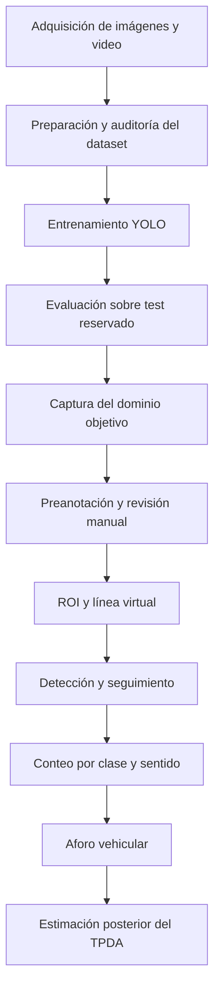

# MCI-509 · Aforo vehicular con YOLO

Sistema de visión computacional para detección, clasificación, seguimiento y conteo vehicular mediante YOLO, orientado a generar aforos clasificados como insumo para la estimación del Tránsito Promedio Diario Anual (TPDA).

Proyecto final del módulo **MCI-509 – Procesamiento de Imágenes y Visión Computacional**.

## Objetivo

El proyecto desarrolla un pipeline reproducible capaz de:

- detectar vehículos en imágenes, videos y transmisiones públicas;
- clasificar seis tipos de vehículos;
- realizar seguimiento multiobjeto;
- definir una región de interés (ROI) y una línea virtual de conteo;
- contar cruces por sentido de circulación;
- adaptar el detector a imágenes de una cámara objetivo;
- producir información para la estimación posterior del TPDA.

El sistema cuenta vehículos que cruzan una sección vial definida, evitando contabilizar repetidamente el mismo objeto en fotogramas consecutivos.

## Clases vehiculares

| ID | Clase |
|---:|---|
| 0 | `car` |
| 1 | `threewheel` |
| 2 | `bus` |
| 3 | `truck` |
| 4 | `motorbike` |
| 5 | `van` |

## Pipeline



## Resultados de evaluación

El modelo definitivo fue evaluado una sola vez sobre el conjunto `test` reservado.

### Métricas globales

| Métrica | Resultado |
|---|---:|
| Precisión | 0.9557 |
| Recall | 0.9563 |
| mAP@0.50 | 0.9787 |
| mAP@0.50:0.95 | 0.8960 |

### Métricas por clase

| Clase | Precisión | Recall | F1 | mAP@0.50 | mAP@0.50:0.95 |
|---|---:|---:|---:|---:|---:|
| `car` | 0.96 | 0.96 | 0.96 | 0.98 | 0.94 |
| `threewheel` | 0.97 | 0.97 | 0.97 | 0.99 | 0.90 |
| `bus` | 0.97 | 1.00 | 0.98 | 0.99 | 0.95 |
| `truck` | 0.92 | 0.95 | 0.93 | 0.96 | 0.87 |
| `motorbike` | 0.97 | 0.88 | 0.92 | 0.96 | 0.76 |
| `van` | 0.95 | 0.98 | 0.97 | 0.99 | 0.96 |

Las curvas de precisión, recall, F1, PR y las matrices de confusión están disponibles en `resultados/evaluacion/test_yolo11n_definitivo/`.

> Estas métricas describen el rendimiento sobre el dataset de prueba reservado. No representan todavía una validación operacional completa sobre la cámara objetivo ni una estimación final del TPDA.

## Estructura del repositorio

```text
.
├── 01_prueba_yolo.ipynb
├── camara_tiempo_real.py
├── config_trafico.json
├── notebooks/
│   └── inferencia_cpu.ipynb
├── resultados/
│   ├── auditoria_dataset_final/
│   ├── auditoria_postentrenamiento/
│   └── evaluacion/
├── src/
│   ├── analizar_conflictos_duplicados.py
│   ├── auditar_dataset.py
│   ├── capturar_frames.py
│   ├── entrenar.py
│   ├── evaluar.py
│   ├── evaluate.py
│   ├── generar_evidencia_cualitativa.py
│   ├── preanotar_dominio.py
│   ├── predict.py
│   ├── preparar_dataset.py
│   ├── recortar_roi_dominio.py
│   └── train.py
├── .gitignore
├── requirements.txt
└── README.md
```

## Componentes principales

| Archivo | Función |
|---|---|
| `preparar_dataset.py` | Prepara y divide el dataset en entrenamiento, validación y prueba. |
| `analizar_conflictos_duplicados.py` | Detecta duplicados y conflictos entre particiones. |
| `auditar_dataset.py` | Comprueba imágenes, etiquetas, clases y consistencia estructural. |
| `entrenar.py` | Ejecuta fine-tuning reproducible de YOLO. |
| `train.py` | Entrada estándar de entrenamiento exigida por la rúbrica. |
| `evaluar.py` | Evalúa el modelo sobre el conjunto reservado y exporta métricas. |
| `evaluate.py` | Entrada estándar de evaluación exigida por la rúbrica. |
| `predict.py` | Ejecuta inferencia y exporta predicciones. |
| `generar_evidencia_cualitativa.py` | Selecciona casos correctos y errores representativos. |
| `capturar_frames.py` | Captura cuadros no redundantes desde una fuente de video. |
| `preanotar_dominio.py` | Genera pseudoetiquetas para el dominio objetivo. |
| `recortar_roi_dominio.py` | Recorta la ROI y transforma etiquetas YOLO. |
| `camara_tiempo_real.py` | Ejecuta detección, seguimiento y conteo sobre video o streaming. |

## Requisitos

Entorno de referencia:

- Python 3.11;
- Windows 10/11;
- NVIDIA CUDA 12.6 para ejecución con GPU;
- PyTorch;
- Ultralytics YOLO;
- OpenCV;
- JupyterLab.

La evaluación publicada fue ejecutada con Python 3.11.9, PyTorch 2.13.0+cu126, Ultralytics 8.4.118 y CUDA 12.6. `requirements.txt` conserva el entorno instalable utilizado durante el desarrollo.

## Instalación

```bash
git clone https://github.com/paul-pinto/MCI-509-aforo-vehicular-yolo.git
cd MCI-509-aforo-vehicular-yolo
```

En PowerShell:

```powershell
py -3.11 -m venv .venv
.\.venv\Scripts\Activate.ps1
python -m pip install --upgrade pip
python -m pip install -r requirements.txt
```

Comprobar CUDA:

```powershell
python -c "import torch; print('PyTorch:', torch.__version__); print('CUDA:', torch.cuda.is_available()); print('GPU:', torch.cuda.get_device_name(0) if torch.cuda.is_available() else 'CPU')"
```

## Dataset

El dataset utiliza la estructura YOLO:

```text
dataset/
├── images/
│   ├── train/
│   ├── val/
│   └── test/
├── labels/
│   ├── train/
│   ├── val/
│   └── test/
├── classes.txt
└── data.yaml
```

El dataset no se incluye en el repositorio por su tamaño y porque las licencias de redistribución de todas las imágenes de origen no están garantizadas. Los scripts permiten preparar y auditar la estructura en un entorno autorizado.

## Uso

Todos los scripts principales ofrecen ayuda mediante:

```powershell
python .\src\nombre_script.py --help
```

### Entrenamiento

```powershell
python .\src\train.py `
    --data ".\ruta\al\dataset\data.yaml" `
    --model "yolo11n.pt" `
    --epochs 50 `
    --imgsz 640 `
    --batch 4 `
    --device 0 `
    --seed 42
```

### Evaluación final

```powershell
python .\src\evaluate.py `
    --model ".\runs\entrenamiento\modelo\weights\best.pt" `
    --data ".\ruta\al\dataset\data.yaml" `
    --split test `
    --imgsz 640 `
    --batch 4 `
    --device 0
```

El conjunto `test` debe reservarse exclusivamente para la evaluación final y no debe utilizarse para ajustar hiperparámetros.

### Dominio objetivo y tiempo real

```powershell
python .\src\capturar_frames.py --help
python .\src\preanotar_dominio.py --help
python .\src\recortar_roi_dominio.py --help
python .\camara_tiempo_real.py --help
```

`config_trafico.json` almacena la resolución de referencia, la ROI, la línea virtual y las etiquetas de dirección mediante coordenadas normalizadas.

## Reproducibilidad

El proyecto aplica:

- semilla fija;
- particiones separadas;
- detección de duplicados;
- auditoría antes y después del entrenamiento;
- evaluación aislada sobre `test`;
- registro de versiones;
- hash SHA-256 del modelo evaluado;
- exportación de métricas globales y por clase;
- separación de datasets, pesos y código fuente.

## Limitaciones actuales

- El dataset original y los pesos entrenados no se distribuyen.
- Las clases visualmente similares pueden confundirse.
- `motorbike` presenta el menor mAP@0.50:0.95.
- La cámara objetivo contiene oclusiones y vehículos pequeños.
- Las pseudoetiquetas necesitan corrección humana.
- El TPDA definitivo requiere observaciones temporales representativas y factores de expansión justificados.
- El desempeño sobre `test` no garantiza el mismo resultado ante cambios de iluminación, clima, perspectiva o densidad vehicular.

## Estado del proyecto

- [x] Preparación y auditoría del dataset.
- [x] Control de duplicados y conflictos.
- [x] Entrenamiento reproducible.
- [x] Evaluación sobre conjunto reservado.
- [x] Inferencia en imagen y video.
- [x] Seguimiento multiobjeto.
- [x] Captura y preanotación del dominio objetivo.
- [x] Definición inicial de ROI y línea virtual.
- [ ] Corrección manual del dominio objetivo.
- [ ] Fine-tuning con imágenes de la cámara objetivo.
- [ ] Validación temporal independiente.
- [ ] Campaña de aforo representativa.
- [ ] Estimación y documentación final del TPDA.

## Autores

**Jhonny Paul Pinto Phillips**
**Ronald Marcelo Pinto Delgadillo**  
Maestría en Ciencia de Datos e Inteligencia Artificial  
Universidad Católica Boliviana
2026

## Uso académico

Repositorio desarrollado con fines académicos, educativos y de investigación en visión computacional aplicada al análisis de tránsito.
